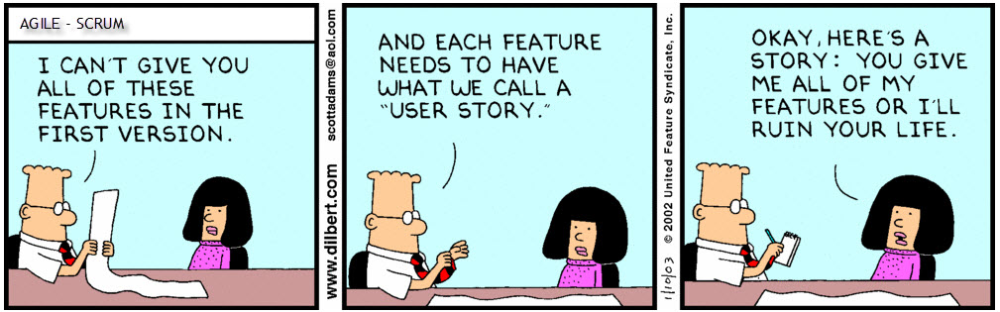

# User Story: план действий для разработчика

Процесс разработки ПО состоит из нескольких последовательных этапов. Первоначальным и в итоге во многом определяющим конечный результат является написание User Story.

**Гибкая методология разработки** (Agile software development) — серия подходов к разработке ПО, ориентированные на кооперацию между всеми членами проекта и адаптивность процесса разработки к неизбежным изменениям.
<u>Существует несколько методик:</u>
* Экстремальное программирование
* DSDM
* Scrum
* FDD

Большинство гибких методологий нацелены на минимизацию рисков путём сведения разработки к серии коротких циклов, называемых итерациями,в результате которых команда сдает готовый проект в миниатюре. По окончании каждой итерации команда выполняет переоценку приоритетов разработки. Также важное отличие Agile-методов в том, что упор делается на общение внутри команды. Основой agile-методов является рабочий продукт. Отдавая предпочтение непосредственному общению, agile-методы уменьшают объём письменной документации.

## Что такое User Story?
User Story — это руководство к действиям по созданию, оптимизации и продвижению продукта. Функции User Story успешно заменяют функциональные спецификации. <i> Вместо того, чтобы тратить время на написание, согласование и обновление спецификаций о требованиях к будущему продукту, заказчик  делает короткие высказывания о том, как пользователь будет пользоваться будущей системой. В ходе обсуждений начальные идеи, заложенные в первоначальных высказываниях, обрастают деталями. </i>

Плюсы User Story по сравнению с спецификациями:

1. Во время создания пользовательской истории разработчики выявляют все слабые стороны продукта и продумывают в формате живого общения, как их решить еще до стадии начала разработки.
2. User Stories создаются в том числе для тестировщиков. Они содержат пользовательские сценарии, которые станут основой тестирования после сдачи проекта.

## Какие требования выдвигаются к написанию пользовательских историй?
* присутствие максимального количества заинтересованных человек
* описание целевой аудитории (четко обозначить роли)
>В качестве… (описание представителя ЦА, его роль в приложении), он получает… (действия в приложении) для… (цели его действий в приложении).

* системаные требования

Хорошая User Story должна соответствовать модели «INVEST»:
1. Внутренне независимой (Independent) - Многие из пользовательских историй по мере наращивания функциональности продукта обретают зависимости, но все же каждый кусочек предоставляет независимую ценность и продукт может быть потенциально доставлен, если разработка будет приостановлена в любой из этих точек.
>Пример:  
1) Как администратор я могу установить правила безопасности пользовательских паролей так, что пользователи будут обязаны создавать и поддерживать безопасные пароли, поддерживая безопасность системы.  
2) Как пользователь я должен следовать правилам безопасности паролей, установленным администратором, чтобы поддерживать безопасность моей учетной записи.    
Здесь стори потребителя зависит от стори администратора – поэтому не несет независимой полезности.  
Путем пересмотра пользовательских историй (и архитектуры системы) мы можем удалить зависимости переразбив стори иным способом – в нашем случае по типу политики безопасности и соединяя воедино установку политики и ее применение в каждой стори:  
1') Как администратор я могу установить период истечения действия пароля, таким образом пользователи будут обязаны периодически менять пароли.  
2') Как администратор я могу установить характеристики сложности пароля, так что пользователи будут обязаны создавать пароли, которые сложно подобрать.  
Теперь каждая история может существовать сама по себе и может быть реализована, оттестирована и доставлена вполне независимо.

2. Структурно изменчивой (Negotiable)
>

3. Ценностно ориентированной (Valuable);
4. Учитывающей критерии оценки каждого этапа (Estimable);
5. Оптимизированной по времени (рассчитаннной на 1 неделю) (Small) ;
6. Проверяемой (легко оценимой в результате) (Testable).

## Рекомендации для написания правильных пользовательских историй

* Написание пользовательской истории – это своеобразный «мозговой штурм», который следует использовать с максимальной выгодой для продукта. Во время ее написания должны быть заданы все вопросы и получены все ответы. Менять что-то на стадии разработки и тем более после сдачи проекта крайне сложно и затратно.
* Вместо одной большой пользовательской истории лучше написать несколько более мелких и точных. Т.е. крупные и громоздкие истории необходимо фрагментировать с учетом конкретики задач, разбивать на более детализированные и мелкие.
* Оптимальный размер User Story (следует ли ее разбивать на под-этапы или же объединять несколько в одну) определяется просто: на разработку должно уходить от 0,5 до 4 «идеального дня». Если уходит больше четырех, то имеет смысл фрагментировать. Если меньше – надо объединять.
* Обязательно прописывайте в истории критерии приемки, поскольку при их наличии тестировать соответствие готового продукта и истории намного легче.
Хотя в большинстве случаев формат пользовательской истории должен соответствовать основным требованиям, но в некоторых случаях, если, к примеру, речь идет о дизайне, можно ограничиться более свободным форматом в виде скетчей или набросков.
* Следующий совет может кого-то и удивит, но его практическая польза подтверждалась неоднократно. В процессе работы над созданием User Story желательно использовать небольшие бумажные карточки. При командной работе этот метод просто незаменим, поскольку способствует динамике процесса. Готовую пользовательскую историю также не следует убирать с глаз долой в недра ноутбука или письменного стола. Повесьте их на стену, это будет очередной мотиватор для выполнения поставленной задачи.

## Что делать не стоит?
* Чрезмерно детализировать. Из-за слишком подробной, описанной в деталях User Story, процесс ее обсуждения командой может быть сведен к минимуму, что не всегда хорошо для поиска оптимального решения поставленной задачи. Всегда нужно оставлять место для творчества, а формальный подход с ним, как известно, несовместим.
* При всех соблазнах сделать это пропускать обсуждение ни в коем случае не стоит. Даже если, на первый взгляд, все совершенно очевидно. Именно в процессе обсуждения можно, как говорится, расставить все точки над і.
* Формат User Story не предполагает наличие технических задач.

Необходимо отметить, что User Story не является чем-то нерушимым и не приемлющим каких-либо изменений. В принципе, при необходимости заказчик может добавлять новые пользовательские истории, менять приоритеты и т.д. Это вполне допустимо. При этом разработчик со своей стороны обязан объяснить заказчику, чем чревато будет предложенное изменение или добавление. Живое общение на этой стадии — залог успеха в будущем. Ведь создание успешного мобильного приложения – это блестящая идея + не менее блестящее ее воплощение. А для последнего значение правильно написанной User Story вряд ли можно переоценить.

Мы посоветовались с экспертами в области мобильной разработки и выяснили, как с их точки зрения лучше работать с историей.

## Анна Минникова, Гиперболоид, сертифицированный Scrum Professional, работала продакт и проджект менеджером в крупнейших геомобильных приложениях СНГ, сейчас занимается lean коучингом.

### 1. Как правильно написать User Story?

Командой. Причем команда обязательно должна включать в себя менеджера продукта/клиента/стейкхолдера или даже конечных пользователей вашего продукта. Пишите user story не для того, чтобы получить формальные «требования», а чтобы вытащить на свет все важные для вашего продукта, бизнеса и пользователей нюансы.

Обязательно формулируйте персоны вашего продукта до начала работы над user story. Это поможет вам лучше прочувствовать пользовательские нужды/боли/желания и лучше понять, для кого вы проектируете ваш продукт.

Ваша идеальная история должна быть написана по такому образцу:
> Как, <роль пользователя>, я <что-то хочу получить>, <с такой-то целью>

Сейчас вы сформулировали бизнес-ценность для пользователя вашего продукта. Но прелесть пользовательской истории в том, что она формулирует не только бизнес-ценность, но и требования для разработки и тестирования. К этой простой формулировке вы можете добавить критерии приемки, технические заметки, описание обработки ошибок, которые суммируют все задачи, которые вам нужно сделать.

Вот как в укороченном виде выглядела пользовательская история в одном из моих проектов:
Как водитель с загоревшейся лампочкой бензина я хочу быстро найти ближайшую хорошую заправку, чтобы заправиться качественным бензином.

Критерии приемки:

1. Как водитель с загоревшейся лампочкой я могу просмотреть все ближайшие заправки.
2. Как … я могу выбрать заправки подходящих мне брендов АЗС.
3. Как … я могу видеть ближайшие заправки выбраннах брендов списком.
4. Как … я могу видеть ближайшие заправки выбранных на карте.

### 2. Как объективно оценить ее полезность и востребованность?
Пользовательские истории полезны, если вы понимаете, что с написанием пользовательской истории для самого простого проекта вы ступили на тяжелый путь сомнений: «зачем мы делаем наш продукт»?, «точно ли нужна эта фича в продукте?», «да пользователей с такими потребностями днем с огнем не сыщешь», «кто будет пользоваться тем, что мы делаем?». Эти вопросы не очень приятны, но честные ответы на них помогут вам спроектировать лучший продукт.

### 3. Чего делать не стоит при работе с User Story?
Писать их в гордом одиночестве или поручать написать пользовательские истории, к примеру, менеджеру проекта. Если, конечно, вы не являетесь конечным core пользователем продукта, который вы разрабатываете :)

Также не очень здорово писать объемные, большие истории. Если ваша история не вмещается в стандартную итерацию вашей команды (я надеюсь, что это максимум 4 недели:), то она слишком велика и стоит задуматься, как можно ее поделить на несколько.

И самые главные грабли – писать пользовательские истории, которые пойдут в разработку, до того, как вы прошли через процесс customer development. Хорошо сделать это для общего понимания того, что пользователь, по вашему мнению, будет делать с продуктом.

Но пользовательские истории нужно писать не только для того, чтобы выразить ваше мнение о продукте или мнение заказчика. Они должны выражать мнение тех, кто будет покупать и пользоваться продуктом (не забудьте о том, что это не только конечные пользователи, но и те, кто оказывают влияние на совершение покупки. К примеру, конечными пользователями игр часто являются дети, но покупают их родители).

Поэтому для того, чтобы написать ценную и реалистичную пользовательскую историю, вам нужно получить максимум информации о ваших будущих пользователях:
* считают ли они проблему, которую решает ваш продукт, достаточно серьезной (к примеру, все * * игры решают серьезную проблему – убийство времени и побег от скуки);
* как они решают свои проблемы сейчас;
* какие заменители или конкуренты есть у вашего продукта;
* и еще массу важных моментов, которые стоит узнать до того, как вы написали гору кода :).

Это самый большой и объемный пункт, поэтому очень хочу порекомендовать к прочтению 2 книги:

Four Steps to the Epiphany – библия customer development, которая даст вам фундаментальное понимание об этапе создания продуктов, которые вам нужно пройти перед тем, как написать пользовательские истории.

User Stories Applied – самая лучшая и полная книга о том, как писать, оценивать, тестировать и принимать пользовательские истории.

## Евгений Плохой, CEO at CapableBits, Founder of CBLabs.mobi
Я бы сказал, что user story – это инструмент. Инструмент этот обычно используют outsroucing компании. Он позволяет начать диалог с клиентом и работать в одной карте понимания задачи. Так что чаще всего user story пишет заказчик. Сам формат user story, который выглядит так «As !WHO! I want !WHAT! so that !WHY!» предполагает, что её пишет пользователь/заказчик, который объясняет ЧТО он хочет и ЗАЧЕМ. Мы разрабатываем продукты для глобального рынка и разрабатываем продукты самостоятельно, поэтому таким инструментом, как user story мы не пользуемся. Для нас более актуальными являются сценарии использования, которые мы в том числе используем для QA продукта.

### 1. Как правильно написать User Story?
Хорошая User Story должна соответствовать модели INVEST.

### 2. Как объективно оценить ее полезность и востребованность?
Объективно оценить её полезность и востребованность достаточно сложно, т.к. непосредственно в процессе разработки она не участвует, а служит отправной точкой. Это способ начать диалог без понятных маркеров его завершения. Субъективно для нас этот инструмент бесполезен.
* Использовать историю для выполнения которой требуется более одной итерации
* Писать громоздкие истории.
* Использовать жаргон.
* Сразу привязывать историю к конкретному интерфейсу.

## User story от Юлии Козловой, PR & Event Manager в Touch Instinct
### 1. Как правильно написать User Story?
Не важно то, как она будет написана и оформлена, главное – насколько правильно и точно она описывает потребности пользователя. В Touch Instinct мы проговариваем пользовательскую историю с клиентом устно, во время переговоров. Делаем заметки. Кто пользователи, чего они хотят? Мы выясняем формализованные потребности: мгновенная покупка, удобное чтение новостей, бронирование мест, заказ билетов и т.д., из которых прорабатываем детальные требования к сценариям использования будущей программы. «Я как пользователь хочу сортировать товары по цене, чтобы выбрать лучшее из одной ценовой категории». «Я как пользователь хочу сохранять музыку в кэш, чтобы слушать без интернета». Далее на основе юз кейсов строим интерфейс, на этом этапе мы понимаем, от какого функционала стоит отказаться, например,  нужны ли комментарии к фотографиям или нет.

### 2. Как объективно оценить ее полезность и востребованность?
Заказчик хорошо знает свой продукт и потребителя. На переговорах мы стараемся вытянуть из него максимальную информацию о том, чего хочет пользователь. Полезность юзер стори прежде всего в том, что они помогают разработчику лучше понять область, продукт, аудиторию заказчика. Мы не совершаем действий ради действий. Востребованность юзер стори оценивается обнаружением и проработкой пользовательских потребностей, на выходе продукт их должен удовлетворять.

### 3. Чего делать не стоит при работе с user story?
Не стоит зацикливаться и затягивать с проработкой. Зафиксировали ключевой функционал, держите его в фокусе, перед глазами, но не воспринимайте как инструкцию. Юзер стори достаточно гибкая вещь, в которую можно вносить изменения.

## Наталия Давыдова, менеджер Heads and Hands
User Story обычно используется при гибких методологиях разработки. В нашей компании часть проектов ведется по такой методологии. Обычно мы организуем встречу с клиентом, на которой просим его описать обычным пользовательским языком пожелания к функционалу сайта или мобильного приложения. На основе этого мы составляем конечное описание работ для итерации (беклог). Правильный пользовательский сценарий, на наш взгляд, должен быть:
* понятным для всех участников проекта (и конечного пользователя);
* коротким, чтобы можно было оценить сроки его выполнения, но при этом с достаточно точным описанием;
* сценарий должен совпадать по смыслу и идее с основным проектом (чтобы очередная итерация «не выпадала» из общей идеи проекта. Это как раз слабое место гибких методологий, потому что при большом количестве итераций порой забывается основная идея и смысл проекта, он обрастает дополнительным и не всегда нужным функционалом, превращаясь в громоздкого «Франкенштейна»)

Объективно можно оценить полезность в том случае, если по user story можно сформировать удобный и понятный конечному потребителю продукта интерфейс.

При написании user story нужно стараться придерживаться максимально простого описания (без ухода в технические детали), учитывать роли пользователей при работе с продуктом, стараться не увеличивать размер истории, т.к. это должно вписаться в одну итерацию, которая при гибких методологиях длится не более 2х недель.

## Selet Team
### Examples:
* Я незарегестрированный пользователь и и я хочу **зарегестрироваться**
* Я зарегестрированный пользователь и я хочу **войти в свой профиль**
* Я пользователь и я хочу **видеть текущие проекты**
* Я пользователь и я хочу **подать заявку на участие в проекте**
* Я руководитель и я хочу **создавать проекты**
* Я руководитель и я хочу **одобрять заявки на участие**
* Я администратор и я хочу **распределять права доступа**
* Я пользователь и я хочу **видеть своё портфолио**
* Я пользователь и я хочу **видеть список пользователей**
* Я пользователь и я хочу **видеть портфолио других пользователей**
* Я администратор и я хочу **редактировать портфолио других пользователей**

#### Links
https://ru.wikipedia.org/wiki/Пользовательские_истории
http://apps4all.ru/post/06-17-15-andrash-gusti-begemot-begemot-yuzerstori-eto-kontseptualno-prosto-i-modnohttps://habrahabr.ru/company/luxoft/blog/82066/ - Основы пользов историй (3 части)
http://devprom.ru/news/История-пользователя-User-Story
http://2tickets2dublin.com/how-to-write-good-user-stories-part-1/ - как писать хорошие польз истории
https://megamozg.ru/company/friifond/blog/8686/
http://apptractor.ru/develop/user-story-plan-deystviy-dlya-razrabotchika.html - User Story: план действий для разработчика
