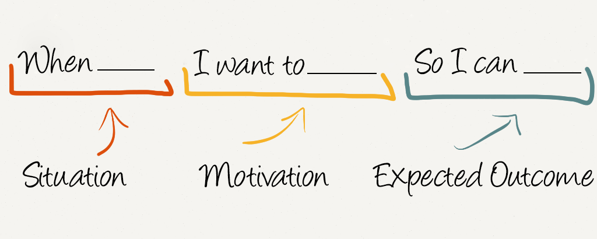
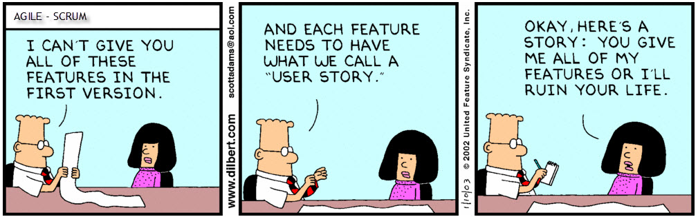

# User Story: план действий для разработчика

На сегодняшний день разработка мобильных приложений перестала быть уделом только лишь умудренных опытом специалистов. Все чаще результат работы разработчика-самоучки становится намного интереснее и гораздо полезнее для конечного пользователя, о чем свидетельствует высокие рейтинги продуктов независимых программистов в сторах. Удачный выбор идеи все еще остается основополагающим фактором успеха приложения. Кроме того, в наше время создать успешное мобильное приложение может даже человек весьма далекий от программирования, поскольку для этого существует аутсорсинг.

Процесс разработки мобильного приложения состоит из нескольких последовательных этапов. Первоначальным и в итоге во многом определяющим конечный результат является написание User Story.
## Что такое User Story?
User Story в первую очередь — это руководство к действиям по созданию, оптимизации и продвижению продукта. Во-вторых, это возможность еще раз оценить перспективы продукта. В большом WEB и среди разработчиков ПО функции User Story успешно заменяют функциональные спецификации.

Три довода в пользу User Story по сравнению с спецификациями при разработке мобильного приложения:

1. Во время создания пользовательской истории разработчики продумывают, как решать ряд задач еще до стадии начала процесс разработки. User Story отлично помогает взглянуть на всю систему целиком.
2. Пользовательские истории являются результатом работы команды, в отличие от спецификаций. Обычно последние пишутся одним или несколькими людьми в команде. Как предмет коллективной работы, пользовательские истории помогают выявить все слабые стороны продукта и решить все проблемы в реализации идеи до разработки в формате живого общения.
3. User Stories создаются в том числе для тестировщиков. Они содержат пользовательские сценарии, которые станут основой тестирования после сдачи проекта.

Как было сказано выше, правильно написанная пользовательская история позволяет избежать множества распространенных проблем, главная из которых — неправильное представление конечного продукта разработчиком. Ситуация, кстати, достаточно распространенная. И в интересах издателя, чтобы результат разработки мобильного приложения полностью соответствовал требованиям и ожиданиям пользователя, а значит, созданию User Story следует уделить особое внимание.

## Какие требования выдвигаются к написанию пользовательских историй?
В первую очередь необходимо, чтобы при написании пользовательской истории присутствовало максимальное количество заинтересованных человек. Написание хорошей User Story — коллективный труд, в котором важна командная работа, целью которой является продумывание всех нюансов. Этот тот самый случай, когда две головы лучше одной.

В случае создания мобильных приложений разработчик должен хорошо представлять основные требования, которые пользователь будет выдвигать к создаваемому приложению. На основе этих требований и следует формировать пользовательскую историю. Она должна вести виртуального пользователя по всем страницам приложения, решая на каждом этапе совершенно конкретную задачу. В итоге шаги трансформируются в разделы, а решения — в функционал.

Начинать User Story лучше всего с описания целевой аудитории. Самый важный момент на этой стадии — четкое обозначение ролей в приложении. Далее следует расписать каждую роль в зависимости от действий в приложении, которые приводят к определенному результату. Схема выглядит примерно так:
>В качестве… (описание представителя ЦА, его роль в приложении), он получает… (действия в приложении) для… (цели его действий в приложении).

Без наличия хотя бы одной из описанных характеристик теряется пользовательская ценность истории, что в итоге может привести к разногласиям в момент приемки. Проработка всех возможных сценариев очень важна, поскольку такой подход позволяет избежать некоторых достаточно неприятных сюрпризов на последующих этапах создания мобильного приложения.

Окончательная формулировка истории должна быть лаконичной и точной. Если сформулированная заказчиком история содержит сложные расплывчатые понятия, ее следует переписать. В идеале User Story должна быть:
1. Внутренне независимой;
2. Структурно изменчивой;
3. Ценностно ориентированной;
4. Учитывающей критерии оценки каждого этапа;
5. Оптимизированной по времени (рассчитаннной на 1 неделю);
6. Проверяемой (легко оценимой в результате)

## Selet Team
##### Examples:
* Я незарегестрированный пользователь и и я хочу **зарегестрироваться**
* Я зарегестрированный пользователь и я хочу **войти в свой профиль**
* Я пользователь и я хочу **видеть текущие проекты**
* Я пользователь и я хочу **подать заявку на участие в проекте**
* Я руководитель и я хочу **создавать проекты**
* Я руководитель и я хочу **одобрять заявки на участие**
* Я администратор и я хочу **распределять права доступа**
* Я пользователь и я хочу **видеть своё портфолио**
* Я пользователь и я хочу **видеть список пользователей**
* Я пользователь и я хочу **видеть портфолио других пользователей**
* Я администратор и я хочу **редактировать портфолио других пользователей**
