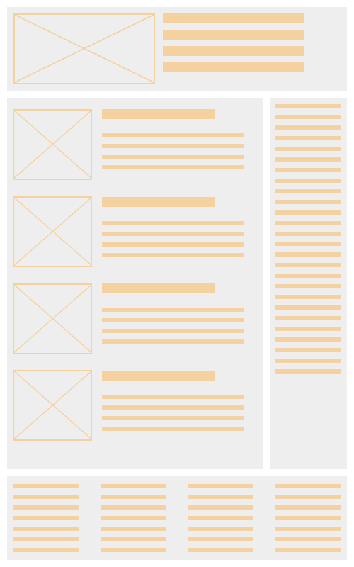
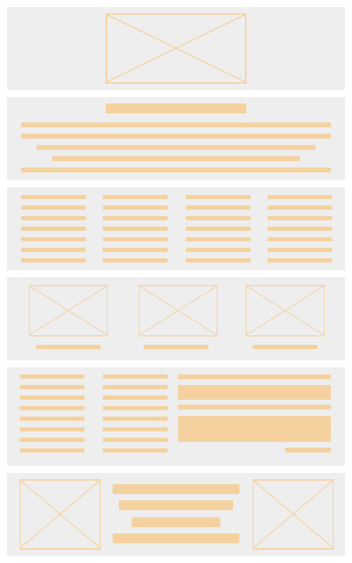

# Short intro to Front End Development
## История развития методологий и подходов к разработке веб интерфейсов и верстки

### Типичные макеты

 
Вёрстка веб-страниц — создание структуры html-кода, размещающего элементы веб-страницы (изображения, текст и т. д.) в окне браузера, согласно разработанному макету, таким образом, чтобы элементы дизайна выглядели аналогично макету.

Вёрстка веб-страниц отличается от полиграфической тем, что необходимо учитывать разницу отображения элементов в различных браузерах и разницу в размерах рабочего пространства устройств.

Процесс сложен и имеет творческую основу, ни один из способов не является каноничным и принятым как основа. Все подходы к верстке имеют как преимущества, так и недостатки.

Хотя работа верстальщика скрыта от глаз, именно она обеспечивает бесперебойность при работе на различных устройствах, а также скорость загрузки каждой страницы сайта.

## История развития верстки веб-страниц
Тим Бернерс-Ли, работая в Европейском институте физики частиц придумал язык, который концентрировался не на средствах оформления, а на логике разметки текста. Некоторое время страницы оформлялись в так называемом «академическом дизайне», например, lib.ru.

С появлением браузера Netscape ситуация изменилась. Разработчики браузера внедряли нестандартные для html теги, призванные улучшить внешний вид документа. Браузер был настолько распространённым, что нестандартные теги не вызывали беспокойств: нет смысла беспокоиться о том, что другие браузеры не поддерживают эти теги, когда только 10 % посетителей пользуется другими браузерами. Сайты перестали разрабатываться в «академическом» стиле. Над дизайном стали задумываться, а значит, потребовалась более сложная верстка.

С середины 1990-х MS Internet Explorer захватывал всё большую часть потребителей. Подходы разработчиков браузеров различались, отличался и набор поддерживаемых технологий. Всё это лишь добавляло неудобств для разработчиков сайтов — увеличивая время разработки сайта[3].

Через некоторое время работать блоками стало слишком неудобно, т. к. поддержки CSS у браузеров фактически не было, приходилось вставлять стили прямо в блоки, что усложняло разработку. В это время для разработки стали применяться таблицы с невидимой границей, где многие стили не требовались — они были по умолчанию.

Рождается спецификация Cascading Style Sheets Level 2 (CSS2), а потом и CSS2.1, что позволило выносить код оформления блоков в отдельные файлы и использовать на всех страницах сайта и даже кешировать этот файл, а значит ускорять загрузку страниц. Развитие этой технологии и поддержка со стороны браузеров привела к использованию блочной верстки, вместо таблиц.

## Этапы работы
Почему прямоугольники?
Прямоугольник получил исключительное значение благодаря способности делиться на любое число прямоугольников любых пропорций.
Как правило верстальщик получает от дизайнера утверждённый дизайн-макет страницы. Далее, верстальщик анализирует полученный макет. Разбивает его на горизонтальные линии (полосы) — «этажи». Далее, каждый «этаж» анализируется отдельно и разбивается на прямоугольные блоки — колонки.

Далее происходит рекурсивный процесс верстки этих отдельных строк, а в них столбцов.

После верстки страница проверяется на кросс-платформенность. В общем случае можно отвечать на следующие вопросы:

Одинаково ли отображается страница в браузерах и на разных операционных системах?
Происходит ли критичное смещение блоков, если изменять размер шрифта в настройках браузера в меньшую и большую сторону?
Происходит ли критичный сдвиг блоков, если отключить показ изображений в браузере?
Оказывает ли существенное влияние на целостность страницы разрешение монитора?
Критические исправления вносятся в документ и проверка повторяется с самого начала.
